# Собаки на выданье

Слева направо: Пух, Зита, Гита, Уголёк, Искорка.

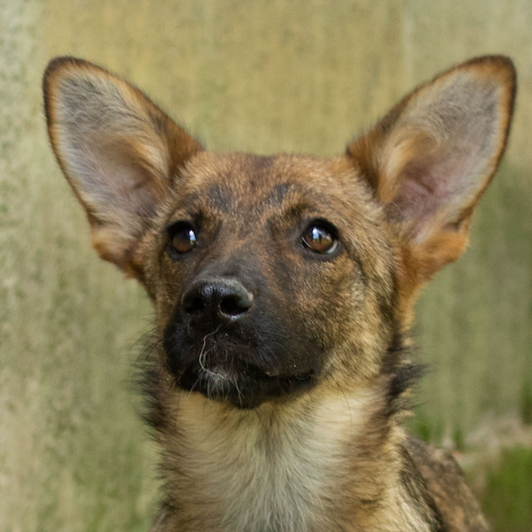
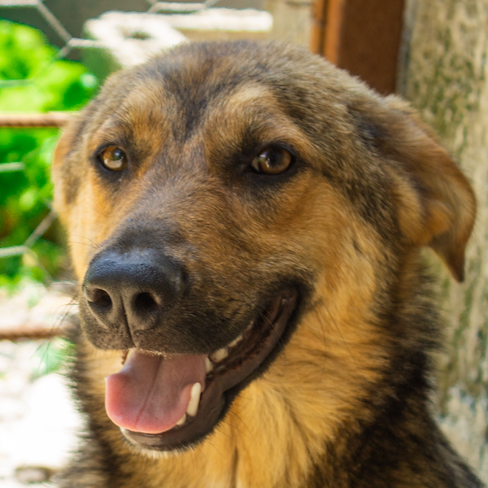
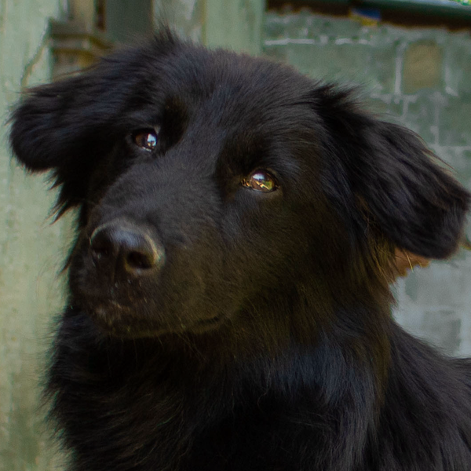
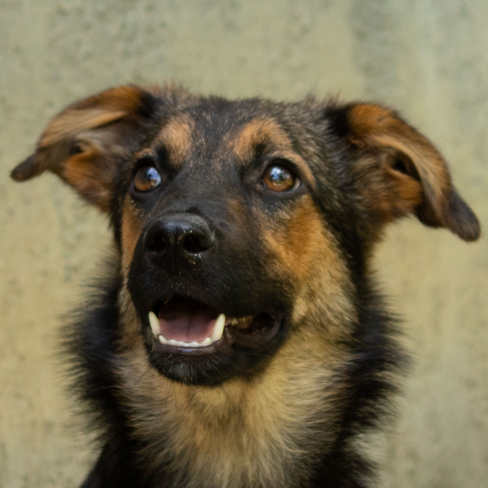

 

В ноябре 2023 года я нашёл шестерых малышей выброшенными и замерзающими на пляже Поти, в Грузии.

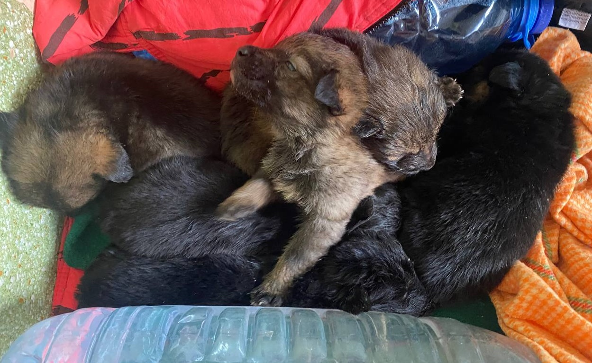

Один щеночек к сожалению не выжил, но пятерых остальных удалось вылечить и выходить. Всех собачек стерилизовали, привили, (три раза, всё как положено), оформили паспорт международного образца.

Собаки крайне добрые, человечные, контактные. Зита и Искорка особенно дружат, не отходят друг от друга.

Малышам сейчас чуть меньше 9 месяцев, сначала они жили в приюте, а теперь в передержке в городе Поти.

**Собачкам очень нужен дом и немножечко любви.**

Размером пёсики невелики: сантиметров 50 в холке, и уже не вырастут.

Пух:
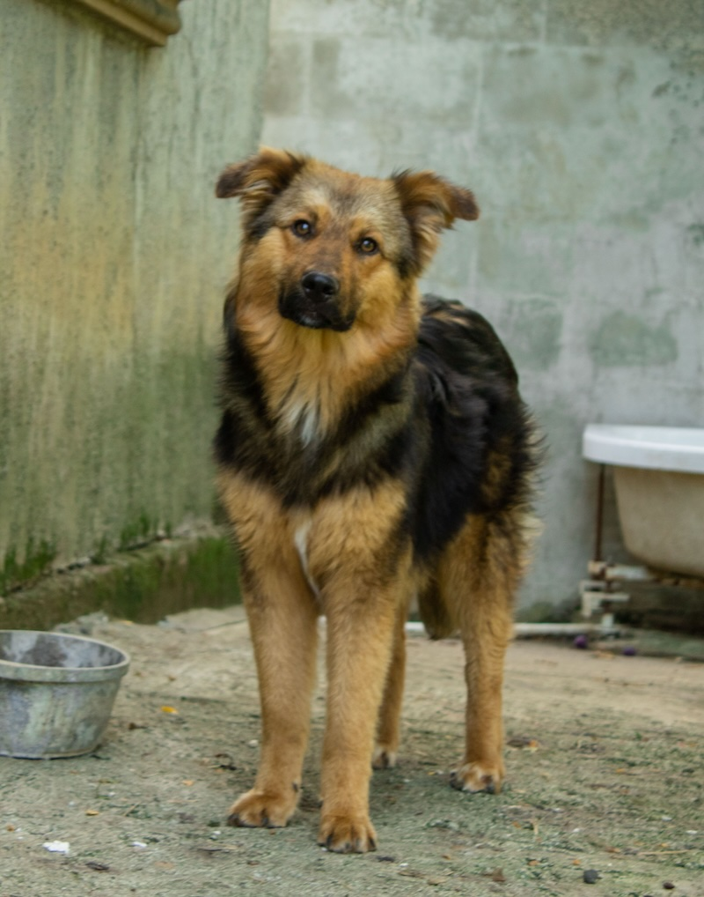

Зита:
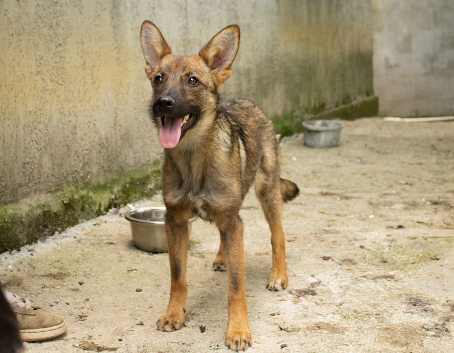

Гита:
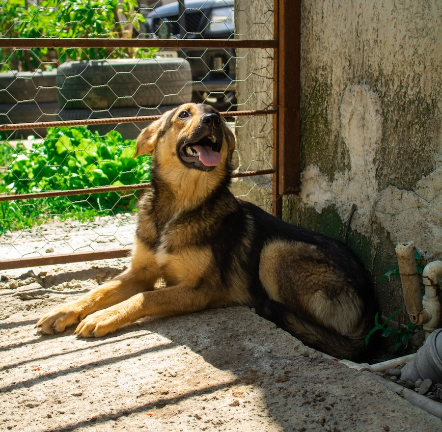

Уголёк:
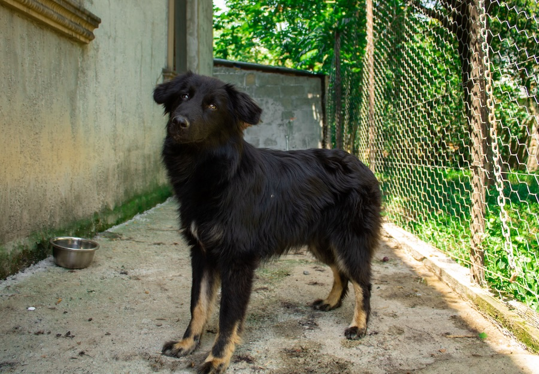

Искорка:
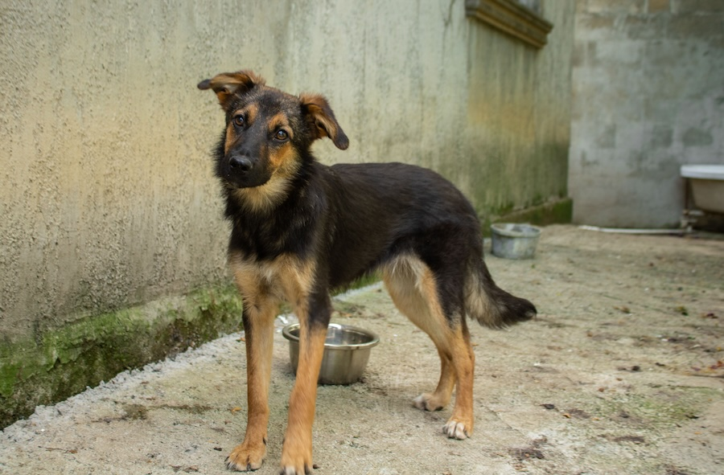

Пух, Уголёк и Гита:
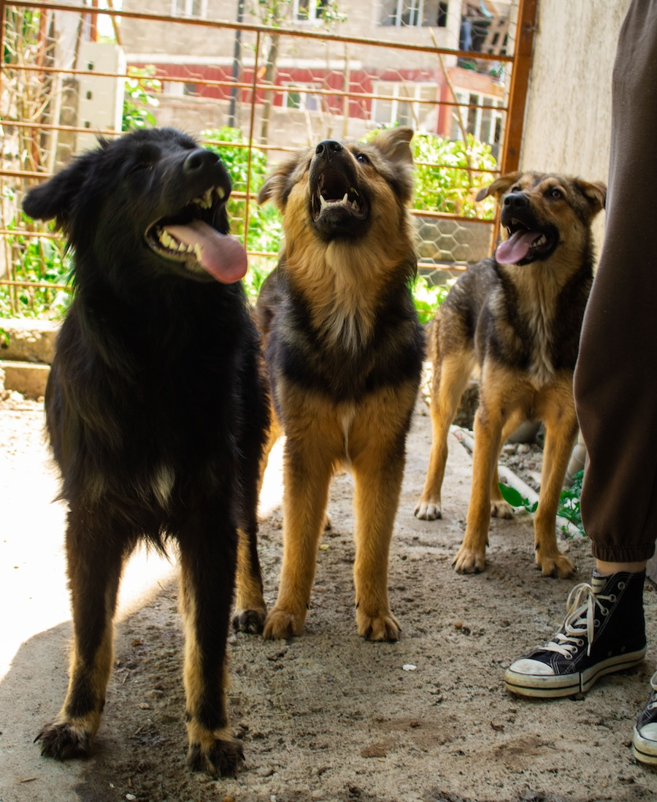

